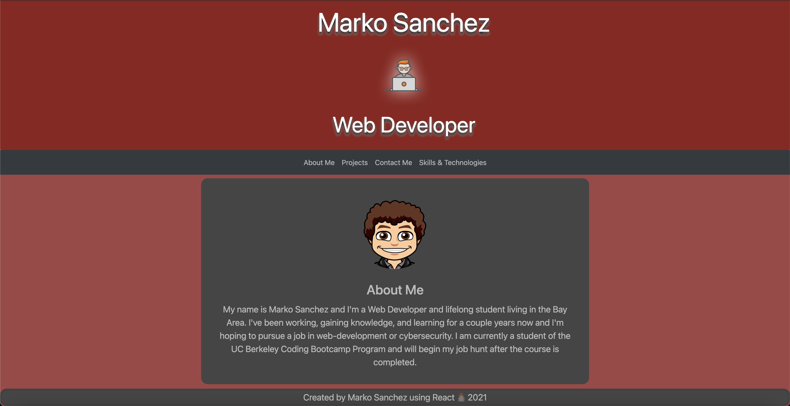

# React Portfolio

## Summary 
This is a portfolio for all my work, information about me, and links to all my important sites/profiles.  It was all created using React and react-bootstrap to create a dynamic individual looking site.

## Deployed Site

## Technology Used
- JavaScript - Language used to build the entire site
-  CSS - Used to give additional styling for a more persona look
- React.js - Used as the library to create the dynamic site
- Node.js - Used to run all processes from the command line
- react-bootstrap - Used to create  the elements such as cards and jumbotrons
- GitHub - Used to track active changes and deploy site

## Author Links 
- [LinkedIn] (https://www.linkedin.com/in/marko-sanchez-800)
- [GitHub] (https://github.com/markosanchez800)